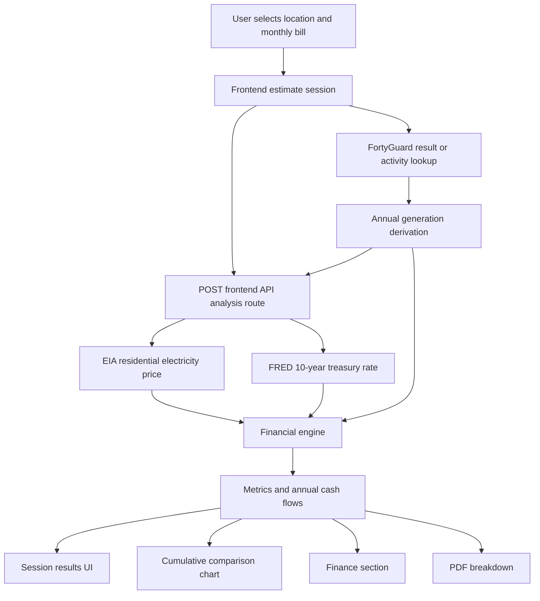

# SolarSave Workspace

SolarSave is a location-based solar estimation workspace that combines:

- a frontend estimation experience,
- a server/API layer for live analysis,
- and a reusable financial-engine package lineage.

The current workspace is centered around a **single-structure architecture**: the main product flow now lives in the `frontend` app, where UI, API integration, solar derivation logic, and financial presentation are coordinated as one coherent application structure rather than as disconnected product layers.

---

## Workspace overview

### Directories

- `frontend/`
  - Main application surface.
  - Contains UI, app routes, API routes, estimate flow, calculation helpers, map rendering, charting, PDF export, and data transformation logic.
- `server/`
  - Reserved backend/server area in the workspace.
  - The active estimation flow currently relies primarily on the API route inside `frontend`.
- `solarsave-financial-engine/`
  - Historical/reference package lineage for the financial model.
  - The current frontend API helper in `frontend/src/lib/financial-engine.ts` reflects the active implementation used by the product.

---

## Current architecture

## Single-structure architecture

The application now effectively follows a **single structure architecture** for the estimate flow:

1. **User selects or confirms location** in the frontend.
2. **Monthly electricity bill** is chosen or adjusted in the frontend.
3. **FortyGuard environmental data** is used to derive solar generation inputs.
4. **Frontend API analysis route** enriches the request with electricity pricing and treasury-rate data.
5. **Financial engine** computes annual cash flows and long-term metrics.
6. **Frontend UI** renders:
   - annual grid consumption,
   - estimated annual solar generation,
   - GHI and model assumptions,
   - cumulative cost comparison,
   - finance cards,
   - map/location context,
   - and downloadable PDF breakdowns.

This keeps the product easier to reason about because the estimation experience, derivation logic, financial analysis, and result presentation live in one main code path.

---

## Key files and responsibilities

### Analysis and financial model

- `frontend/src/app/api/analysis/route.ts`
  - Main analysis endpoint used by the frontend.
  - Validates request inputs.
  - Fetches or accepts FortyGuard result data.
  - Derives annual generation when needed.
  - Fetches electricity price and treasury rate.
  - Runs the financial engine.
  - Returns result metrics, annual cash flows, and derivation diagnostics.

- `frontend/src/lib/financial-engine.ts`
  - Core financial model implementation.
  - Fetches residential electricity price from EIA.
  - Fetches the latest 10-year treasury rate from FRED.
  - Computes annual cash flows, NPV, IRR, ROI, payback, and summary metrics.

- `frontend/src/lib/fortyguard-to-generation.ts`
  - Converts a FortyGuard GHI sample into annual irradiance and estimated annual solar generation.
  - Encodes state-level peak-sun-hours defaults.
  - Exposes derivation transparency via `derived` and warning fields.

### Frontend estimate experience

- `frontend/src/components/estimate/sections/estimate-result-sections.tsx`
  - Main results presentation.
  - Displays session outputs.
  - Generates the PDF breakdown.
  - Shows GHI, annual consumption, annual generation, financial metrics, and the cumulative cost chart.

- `frontend/src/components/estimate/sections/finance-section.tsx`
  - Financing UI.
  - Buy/lease presentation and summary cards.

- `frontend/src/components/estimate/sections/finance-comparison-chart.tsx`
  - Cumulative cost chart.
  - Plots the three comparison series and hover values.

- `frontend/src/lib/solar-comparison.ts`
  - Builds chart-ready cumulative cost series from backend annual cash flow rows.

- `frontend/src/components/estimate/sections/map-render.tsx`
  - Renders the location map.
  - Fits the map cleanly to the selected location.

- `frontend/src/components/estimate/estimate-session-context.tsx`
  - Stores and shares estimate session data between UI parts.

### Supporting estimation helpers

- `frontend/src/lib/estimate-calculations.ts`
  - Lightweight frontend-side estimate helpers for UI defaults and early display values.

---

## Data flow

---

## Calculation model

This section documents the active model as implemented in the codebase.

## 1. Grid annual consumption

When annual household electricity consumption is not explicitly provided, it is derived from the selected monthly bill and the state residential electricity price.

### Formula

`annualConsumptionKwh = (monthlyBill × 12) ÷ pricePerKwh`

### Meaning

- `monthlyBill` is the selected or inferred household electricity spend.
- `pricePerKwh` comes from the latest state residential rate fetched from EIA.
- The result estimates how much energy the household consumes from the grid in one year.

### Why this exists

The frontend typically begins with a spending input rather than a utility-bill kWh history. This formula converts that spend into an energy baseline.

---

## 2. Solar irradiance derivation from FortyGuard GHI

The current system derives annual irradiance from a **single numeric GHI sample** returned by FortyGuard.

### Current formula

`annualIrradianceKwhPerM2 = GHI × peakSunHoursPerDay × 365 ÷ 1000`

### Units

- `GHI` is treated as watts per square meter (`W/m²`).
- `peakSunHoursPerDay` is a state-level daily-equivalent sun-hours assumption.
- Division by `1000` converts watt-hours to kilowatt-hours.

### Meaning

This is a lightweight annualization approach:

- start from the sampled irradiance value,
- scale it with representative peak sun hours,
- extend that over 365 days,
- convert to yearly irradiance.

### Important caveat

This is a **derived estimate**, not a full production simulation. It assumes that a single GHI sample can be transformed into an annualized irradiance estimate when combined with a state-level peak-sun-hours model.

---

## 3. Estimated annual generation

After deriving annual irradiance, the system estimates annual solar generation with a compact production approximation.

### Formula

`annualGenerationKwh = annualIrradianceKwhPerM2 × systemCapacityKw × performanceRatio`

### Meaning

- `systemCapacityKw` is the assumed or computed residential system size.
- `performanceRatio` is an aggregate efficiency/loss factor.
- The result is the estimated yearly solar energy production.

### Default performance ratio

The current implementation uses a default performance ratio of:

`0.75`

This is a pragmatic quick-estimate assumption that captures combined system losses in a simplified way.

---

## 4. Year-by-year solar generation degradation

Solar production is reduced slightly each year to reflect panel degradation.

### Formula

For year `t`:

`energy_t = E1 × (1 - degradation)^(t - 1)`

Where:

- `E1` = first-year annual generation
- `degradation` = annual degradation rate

### Current default

`annualDegradation = 0.005` (0.5% per year)

---

## 5. Electricity price escalation

The model assumes electricity prices rise over time.

### Formula

For year `t`:

`price_t = initialPricePerKwh × (1 + inflation)^(t - 1)`

### Current default

`electricityInflation = 0.025` (2.5% per year)

---

## 6. Gross solar savings

Yearly gross savings are estimated by valuing solar production at that year's electricity price.

### Formula

`grossSavings_t = solarEnergy_t × price_t`

### Meaning

This is the avoided energy spend attributable to the solar generation estimate.

---

## 7. Maintenance cost

Maintenance can be included and optionally inflated over time.

### Formula

`maintenance_t = baseMaintenance × (1 + maintenanceInflation)^(t - 1)`

### Current defaults

- `annualMaintenanceCost = 0`
- `maintenanceInflation = 0.025`

---

## 8. Net cash flow

### Formula

`netCashFlow_t = grossSavings_t - maintenance_t`

This is the yearly operating benefit before considering the initial installation outlay.

---

## 9. Grid baseline cost

The backend also computes the annual cost of staying on grid using the annual consumption baseline and the year-specific electricity price.

### Formula

`gridCost_t = annualConsumptionKwh × price_t`

### Important note

This was corrected in the current implementation so `gridCost` is now based on annual household consumption, not on solar generation fallback behavior.

---

## 10. Lease comparator

The current lease comparator is simplified.

### Formula

`leaseCost_t = installationCost × 0.08`

### Meaning

This is a simple annual lease-payment approximation used for comparison in the UI. It is not yet a contract-grade lease model.

---

## 11. Instant installation cost

### Formula

`instantInstall = installationCost - incentives`

This is the net upfront outlay after incentives.

In the chart comparison logic:

- **Staying on grid** maps to backend `gridCost`
- **Solar (instant install)** maps to backend `instantInstall`
- **Solar (lease)** maps to backend `leaseCost`

The buy/install cost is treated as a one-time year-1 cost in the comparison chart.

---

## 12. Discount rate

The financial model discounts future cash flows using a treasury-based discount rate plus a risk premium.

### Formula

`discountRate = treasuryRate + riskPremium`

### Current default risk premium

`riskPremium = 0.02` (2%)

### Treasury source

The treasury component comes from the latest available 10-year treasury observation fetched from FRED.

---

## 13. Net present value (NPV)

### Formula

`NPV = Σ [ cashFlow_t ÷ (1 + discountRate)^t ]`

with year 0 cash flow:

`cashFlow_0 = -netInstallationCost`

### Meaning

NPV measures the present-day value of the project after discounting future benefits and costs.

---

## 14. Internal rate of return (IRR)

IRR is the discount rate at which the project's NPV becomes zero.

The current implementation solves IRR numerically using a **bisection method** over the project cash flow series.

---

## 15. Payback period

The backend payback metric is based on cumulative **undiscounted** savings.

### Logic

- Start with negative upfront outlay:
  - `cumulative = -netInstallationCost`
- Add each year's net cash flow.
- The first year where cumulative becomes non-negative is the payback year.

### Important note

The displayed payback in the UI is now taken from the **backend financial result**, not locally inferred by the chart.

---

## 16. ROI

### Formula

`ROI = lifetimeNetProfit ÷ |netInstallationCost|`

Where:

`lifetimeNetProfit = lifetimeOperatingSavings - netInstallationCost`

---

## Active assumptions

These are the current baseline assumptions reflected by the code unless overridden:

- Project years: `25`
- Annual degradation: `0.5%`
- Electricity inflation: `2.5%`
- Maintenance inflation: `2.5%`
- Base maintenance: `$0`
- Risk premium: `2%`
- Performance ratio: `0.75`
- Peak sun hour fallback: `5.0 hours/day`

---

## State peak sun hours

The workspace currently contains a built-in state lookup table in:

- `frontend/src/lib/fortyguard-to-generation.ts`

This table maps US states and state codes to a representative peak-sun-hours/day value for quick annual generation derivation.

### Why this matters

It lets the app derive annual generation even when only a single GHI sample is available.

### Limitation

State-level peak sun hours are a useful shortcut, but they are still a coarse approximation compared with site-specific irradiance time series.

---

## Frontend estimate heuristics

The frontend also contains early-stage UX heuristics in `frontend/src/lib/estimate-calculations.ts`.

These are not the authoritative backend financial model, but they support responsive UI defaults such as:

- default monthly bill,
- early solar size estimate,
- roof area approximation,
- coarse payback preview,
- quick savings estimates.

### Example heuristics

- `solarSizeKw` is inferred from monthly bill and latitude-based adjustment.
- `upfrontCost` is approximated as:
  - `solarSizeKw × 1700`
- `arraySqFt` is approximated as:
  - `solarSizeKw × 53`

These support the UI before or alongside the more complete backend analysis.

---

## Session results terminology

The UI now explicitly separates two annual values:

### 1. Grid annual consumption

Derived from:

- monthly bill,
- electricity price,
- and 12 months.

### 2. Estimated annual generation

Derived from:

- FortyGuard GHI,
- state peak sun hours,
- and days per year,
- then scaled by system size and performance ratio.

This distinction is important because one describes **household demand**, while the other describes **estimated solar supply**.

---

## PDF breakdown

The PDF export is designed to explain the estimate rather than simply restate the UI.

It currently includes:

- executive summary,
- source inputs,
- derivation guide,
- assumptions,
- financial interpretation,
- and a year-by-year cash-flow snapshot.

This is meant to improve transparency and make the estimate easier to review or share.

---

## Current simplifications and limitations

The present model is intentionally lightweight and practical, but not yet a full engineering-grade solar simulation.

### Current simplifications

- Uses a single sampled GHI value rather than a time-series irradiance dataset.
- Uses state-level peak sun hours rather than site-specific hourly solar resource modeling.
- Uses a compact performance-ratio-based production estimate.
- Uses a simplified lease comparator.
- Does not yet model:
  - tilt,
  - azimuth,
  - shading,
  - temperature derates,
  - inverter clipping,
  - seasonal production shape,
  - battery storage,
  - tariff complexity,
  - or time-of-use pricing.

---

## Why time-series GHI from FortyGuard would improve precision

A future improvement would be to use **time-series GHI data** from FortyGuard instead of relying on a single-value derivation.

### Why this would be better

A time-series approach would:

- better capture seasonal variation,
- avoid over-reliance on one sampled irradiance point,
- improve annual generation precision,
- enable weather-normalized or period-aware production estimates,
- support more realistic financial outputs,
- and reduce uncertainty in payback/NPV/ROI.

### Possible future derivation approach

Instead of:

`annualIrradiance = GHI_sample × peakSunHours × 365 ÷ 1000`

the system could aggregate many irradiance observations over time, such as hourly or daily values:

`annualIrradiance = Σ irradiance_interval / 1000`

Then production could be estimated with a more precise interval-based model:

`generation_interval = irradiance_interval × systemFactor × performanceFactor`

and:

`annualGeneration = Σ generation_interval`

### Better future modeling path

An improved production pipeline could use:

1. FortyGuard time-series irradiance,
2. site coordinates,
3. tilt and azimuth,
4. temperature or weather adjustments,
5. inverter/system loss assumptions,
6. optional NREL/PVWatts-style production logic.

That would move SolarSave from a strong quick-estimate tool toward a more production-grade forecast engine.

---

## Suggested next technical improvements

1. **Adopt time-series GHI ingestion from FortyGuard**
   - Replace single-point annualization with interval aggregation.

2. **Introduce a more realistic lease model**
   - Escalators,
   - term lengths,
   - residual assumptions,
   - annual savings split.

3. **Separate quick-estimate UI heuristics from authoritative analysis types**
   - Make distinction even sharper in typing and naming.

4. **Add typed analysis result contracts shared across UI and API**
   - Reduce drift between frontend rendering and backend response shape.

5. **Add tests around formula integrity**
   - annual consumption derivation,
   - generation derivation,
   - grid cost,
   - payback,
   - NPV/IRR behavior.

6. **Add full-report PDF pagination for all annual cash flow rows**
   - Useful for proposal or partner-facing sharing.

---

## Summary

SolarSave currently provides a transparent, explainable solar estimate by combining:

- live irradiance-derived environmental context,
- state electricity pricing,
- treasury-informed discounting,
- a simplified but inspectable financial model,
- and a presentation-focused frontend experience.

Its greatest current strength is **clarity and explainability**.
Its most important next leap in precision would be **moving from a single derived GHI value to time-series irradiance modeling**.
